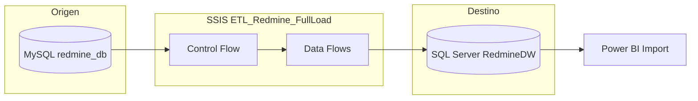
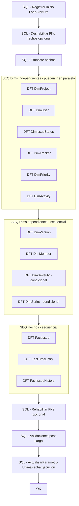
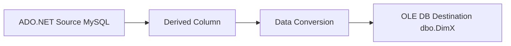
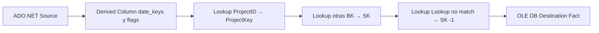

# Diseño SSIS — Package Full Load (`ETL_Redmine_FullLoad`)

Diseño del paquete de **carga inicial** del DW Redmine BI.

| Elemento | Valor |
|----------|-------|
| Proyecto SSIS sugerido | `ETL_RedmineBI` |
| Package | `ETL_Redmine_FullLoad.dtsx` |
| Origen | MySQL `redmine_db` (`127.0.0.1:3306`) |
| Destino | SQL Server `RedmineDW` |
| Estrategia | Truncate + Load (idempotente) |
| Contrato de columnas | [../stm/redmine-stm.xlsx](../stm/redmine-stm.xlsx) |
| DDL destino | [01_create_dw.sql](01_create_dw.sql) |

> Este documento es el **blueprint** para armar el package en SSDT / Visual Studio. No incluye el `.dtsx` binario.

---

## 1. Objetivo

Poblar por primera vez (y poder **re-ejecutar** sin duplicar) todas las dimensiones del núcleo y los hechos operativos, de modo que Power BI pueda calcular Throughput, Estimado vs real, Velocity y Schedule Variance.

### En alcance (v1)

- Dims: Date (ya poblada por DDL), Project, User, IssueStatus, Tracker, Priority, Activity, Version, Member
- Hechos: FactIssue, FactTimeEntry, FactIssueHistory
- Actualización de `Parametros.UltimaFechaEjecucion`

### Fuera de alcance / condicional

| Objeto | Motivo | Cómo tratarlo en el package |
|--------|--------|-----------------------------|
| DimSeverity | No hay custom field hoy | Sequence deshabilitada o Precedence Constraint con variable `@LoadSeverity = false` |
| DimSprint | No hay plugin Agile | Igual que Severity |
| FactBurndownDaily | Snapshot histórico costoso | Package aparte `ETL_Redmine_Burndown` (fase 2) |

---

## 2. Arquitectura



**Sin staging en v1:** el Data Flow lee MySQL y escribe directo a `dbo.*`.  
Si el volumen crece o hay que auditar, agregar `stg.*` 1:1 con el origen en una fase posterior.

---

## 3. Connection Managers

| Nombre | Tipo | Cadena / notas |
|--------|------|----------------|
| `CM_MySQL_Redmine` | ADO.NET (MySql.Data) **o** ODBC | Server=`127.0.0.1`; Port=`3306`; Database=`redmine_db`; User=`admin`; Password=`admin` |
| `CM_OLEDB_RedmineDW` | OLE DB (MSOLEDBSQL / SQLNCLI) | Data Source=`localhost`; Initial Catalog=`RedmineDW`; Integrated Security o SQL Auth |
| `CM_OLEDB_RedmineDW_CMD` | OLE DB (mismo destino) | Usado por Execute SQL Task y OLE DB Command |

Recomendación de laboratorio: cuenta Windows o `sa` local para el DW; en MySQL, más adelante sustituir `admin` por usuario **read-only** solo SELECT.

---

## 4. Variables del package

| Variable | Tipo | Valor default | Uso |
|----------|------|---------------|-----|
| `User::LoadStartUtc` | DateTime | — | Se asigna al inicio; se graba en Parametros al final |
| `User::RowsFactIssue` | Int32 | 0 | Contadores opcionales (Row Count) |
| `User::RowsFactTimeEntry` | Int32 | 0 | idem |
| `User::LoadSeverity` | Boolean | `False` | Activa/desactiva DF DimSeverity |
| `User::LoadSprint` | Boolean | `False` | Activa/desactiva DF DimSprint |
| `User::SqlTruncateFacts` | String | ver §5 | Execute SQL |

---

## 5. Control Flow



### 5.1 Paso a paso del Control Flow

| # | Task | Tipo | Qué hace |
|---|------|------|----------|
| 1 | `SQL_SetLoadStart` | Execute SQL | `SELECT GETUTCDATE()` → variable, o `SET @LoadStartUtc = GETDATE()` en script |
| 2 | `SQL_TruncateFacts` | Execute SQL | Truncar hechos (orden seguro con FKs) |
| 3 | `SEQ_Dims_Independent` | Sequence Container | 6 Data Flows de catálogo / entidades base |
| 4 | `SEQ_Dims_Dependent` | Sequence Container | Version, Member (+ Severity/Sprint si flags) |
| 5 | `SEQ_Facts` | Sequence Container | Issue → TimeEntry → History |
| 6 | `SQL_Validate` | Execute SQL | Checklist §9.1 del modelo BI |
| 7 | `SQL_UpdateParam` | Execute SQL | `EXEC dbo.ActualizarParametro 'UltimaFechaEjecucion', ...` |

### 5.2 Truncate (full load)

Orden recomendado (respetando FKs de hechos → dims; las dims **no** se truncan en full load si se quiere conservar miembros `-1` y el historial SCD):

```sql
-- Opción A (laboratorio, más simple): TRUNCATE solo hechos
TRUNCATE TABLE dbo.FactBurndownDaily;
TRUNCATE TABLE dbo.FactIssueHistory;
TRUNCATE TABLE dbo.FactTimeEntry;
TRUNCATE TABLE dbo.FactIssue;
```

Para dims en **full load puro** (reemplazo total, conservando `-1`):

```sql
-- Opción B: borrar filas de negocio, conservar SK = -1
DELETE FROM dbo.DimMember   WHERE MemberKey   <> -1;
DELETE FROM dbo.DimSprint   WHERE SprintKey   <> -1;
DELETE FROM dbo.DimSeverity WHERE SeverityKey <> -1;
DELETE FROM dbo.DimVersion  WHERE VersionKey  <> -1;
DELETE FROM dbo.DimActivity WHERE ActivityKey <> -1;
DELETE FROM dbo.DimPriority WHERE PriorityKey <> -1;
DELETE FROM dbo.DimTracker  WHERE TrackerKey  <> -1;
DELETE FROM dbo.DimIssueStatus WHERE StatusKey <> -1;
DELETE FROM dbo.DimUser     WHERE UserKey     <> -1;
DELETE FROM dbo.DimProject  WHERE ProjectKey  <> -1;
-- DimDate: NO tocar (generada por DDL)
```

**Recomendación v1:** Opción B para dims + Truncate hechos. Así los `-1` y `DimDate` permanecen.

> En full load **no** se llaman los `Actualizar*` SCD: se hace DELETE (≠ -1) + INSERT. Los SPs quedan para el package incremental.

---

## 6. Data Flows — dimensiones

### 6.1 Patrón común (dims independientes)



| Componente | Configuración |
|------------|---------------|
| Source | SQL explícito (no `SELECT *`) con filtros de negocio |
| Derived Column | Cálculos (`FullName`, `StatusName`, `IsOpen`, `Activo=1`, `FechaInicio=GETDATE()` vía SSIS `GETDATE()`) |
| Data Conversion | Alinear tipos MySQL → SQL Server (p.ej. `float`→`DT_NUMERIC`, strings a Unicode) |
| Destination | `dbo.DimX`, mapeo por nombre; **no** mapear la SK (`IDENTITY`) |

### 6.2 SQL origen por dimensión

#### DimProject

```sql
SELECT
  p.id AS ProjectID,
  p.name AS Nombre,
  p.identifier AS Identificador,
  LEFT(COALESCE(p.description, ''), 1000) AS Descripcion,
  p.parent_id AS ParentProjectID,
  p.status AS StatusCode,
  CASE p.status
    WHEN 1 THEN 'Activo'
    WHEN 5 THEN 'Archivado'
    WHEN 9 THEN 'Cerrado'
    ELSE 'Desconocido'
  END AS StatusName,
  p.is_public AS EsPublico,
  p.default_version_id AS DefaultVersionID,
  p.created_on AS CreatedOn
FROM projects p;
```

Derived: `Activo = 1` (literal).

#### DimUser

```sql
SELECT
  u.id AS UserID,
  u.login AS Login,
  u.firstname AS FirstName,
  u.lastname AS LastName,
  CONCAT(u.firstname, ' ', u.lastname) AS FullName,
  e.address AS Email,
  u.type AS UserType,
  u.admin AS EsAdmin,
  u.status AS StatusCode,
  u.last_login_on AS LastLoginOn,
  u.created_on AS CreatedOn
FROM users u
LEFT JOIN email_addresses e
  ON e.user_id = u.id AND e.is_default = 1
WHERE u.id > 0;
-- Opcional: AND u.type = 'User' para excluir Group / Anonymous
```

**No extraer** `hashed_password`, `salt`, `twofa_*`.

#### DimIssueStatus

```sql
SELECT
  id AS StatusID,
  name AS Nombre,
  description AS Descripcion,
  is_closed AS IsClosed,
  position AS Posicion,
  default_done_ratio AS DefaultDoneRatio
FROM issue_statuses;
```

#### DimTracker

```sql
SELECT
  id AS TrackerID,
  name AS Nombre,
  description AS Descripcion,
  is_in_roadmap AS IsInRoadmap,
  position AS Posicion,
  default_status_id AS DefaultStatusID
FROM trackers;
```

#### DimPriority

```sql
SELECT
  id AS PriorityID,
  name AS Nombre,
  position AS Posicion,
  is_default AS IsDefault
FROM enumerations
WHERE type = 'IssuePriority';
```

#### DimActivity

```sql
SELECT
  id AS ActivityID,
  name AS Nombre,
  position AS Posicion,
  is_default AS IsDefault
FROM enumerations
WHERE type = 'TimeEntryActivity';
```

#### DimVersion

```sql
SELECT
  id AS VersionID,
  project_id AS ProjectID,
  name AS Nombre,
  description AS Descripcion,
  effective_date AS EffectiveDate,
  status AS Status,
  CASE WHEN status = 'open' THEN 1 ELSE 0 END AS IsOpen,
  sharing AS Sharing,
  created_on AS CreatedOn
FROM versions;
```

#### DimMember

```sql
SELECT
  mr.id AS MemberRoleID,
  m.id AS MemberID,
  m.user_id AS UserID,
  m.project_id AS ProjectID,
  mr.role_id AS RoleID,
  r.name AS RoleName,
  CASE WHEN r.builtin > 0 THEN 1 ELSE 0 END AS IsBuiltinRole,
  CASE WHEN mr.inherited_from IS NULL THEN 0 ELSE 1 END AS IsInherited,
  m.created_on AS MemberCreatedOn
FROM member_roles mr
JOIN members m ON m.id = mr.member_id
JOIN roles r ON r.id = mr.role_id;
```

---

## 7. Data Flows — hechos

### 7.1 Patrón común (hechos)



**Lookup:** cache full, result column = SK, join a BK, filtro `Activo = 1`.  
**No match:** Derived Column / Replace con constante `-1` (miembro desconocido).

Fórmula `DateKey` en Derived Column (SSIS):

```text
(YEAR([Fecha]) * 10000) + (MONTH([Fecha]) * 100) + DAY([Fecha])
```

Si la fecha es NULL → `DateKey = -1`.

### 7.2 FactIssue

**Source (MySQL)** — preferible vista lógica en el SELECT:

```sql
SELECT
  i.id AS IssueID,
  i.project_id AS ProjectID,
  i.tracker_id AS TrackerID,
  i.status_id AS StatusID,
  i.priority_id AS PriorityID,
  i.fixed_version_id AS VersionID,
  i.author_id AS AuthorID,
  i.assigned_to_id AS AssigneeID,
  i.subject AS IssueSubject,
  i.parent_id AS ParentIssueID,
  CASE WHEN i.parent_id IS NULL THEN 1 ELSE 0 END AS IsRootIssue,
  i.is_private AS IsPrivate,
  s.is_closed AS IsClosed,
  i.estimated_hours AS EstimatedHours,
  i.done_ratio AS DoneRatio,
  i.created_on AS CreatedOn,
  i.due_date AS DueDate,
  i.closed_on AS ClosedOn,
  COALESCE(t.actual_hours, 0) AS ActualHours
FROM issues i
JOIN issue_statuses s ON s.id = i.status_id
LEFT JOIN (
  SELECT issue_id, SUM(hours) AS actual_hours
  FROM time_entries
  WHERE issue_id IS NOT NULL
  GROUP BY issue_id
) t ON t.issue_id = i.id;
```

**Derived Column (medidas):**

| Columna | Expresión |
|---------|-----------|
| `HoursVariance` | `ActualHours - EstimatedHours` (NULL si EstimatedHours NULL) |
| `HoursVariancePct` | `ActualHours / EstimatedHours - 1` (NULL si EstimatedHours NULL/0) |
| `RemainingHours` | `EstimatedHours * (1 - DoneRatio/100.0)` |
| `ScheduleVarianceDays` | días entre ClosedOn y DueDate solo si IsClosed=1 y DueDate not null |
| `OpenIssueCount` | `IsClosed == 0 ? 1 : 0` |
| `CreatedDateKey` / `DueDateKey` / `ClosedDateKey` | fórmula DateKey o -1 |
| `SeverityID` | literal `-1` en v1 (sin custom field) |

**Lookups:** ProjectID, TrackerID, StatusID, PriorityID, VersionID (null→-1), AuthorID, AssigneeID (null→-1), SeverityID→-1.

### 7.3 FactTimeEntry

```sql
SELECT
  te.id AS TimeEntryID,
  te.project_id AS ProjectID,
  te.issue_id AS IssueID,
  te.user_id AS UserID,
  te.activity_id AS ActivityID,
  te.spent_on AS SpentOn,
  te.hours AS Hours,
  te.comments AS EntryComments
FROM time_entries te;
```

- `IssueID` se carga **tal cual** (nullable); no es FK al DW.
- Lookups: Project, User, Activity, SpentOnDateKey.

### 7.4 FactIssueHistory

```sql
SELECT
  jd.id AS IssueHistoryID,
  j.id AS JournalID,
  j.journalized_id AS IssueID,
  j.user_id AS UserID,
  j.created_on AS ChangeTimestamp,
  jd.prop_key AS ChangeProperty,
  jd.old_value AS OldValue,
  jd.value AS NewValue
FROM journals j
JOIN journal_details jd ON jd.journal_id = j.id
WHERE j.journalized_type = 'Issue'
  AND jd.property = 'attr'
  AND jd.prop_key IN ('status_id', 'done_ratio', 'fixed_version_id');
```

**Derived / Conditional Split** por `ChangeProperty` para castear `OldValue`/`NewValue` a StatusID, DoneRatio o VersionID; el resto de columnas de la fila quedan en -1 / NULL según el STM.

**IsClosingEvent:** Lookup Old/New Status → `IsClosed`; `IsClosingEvent = (Old.IsClosed=0 AND New.IsClosed=1)`.

---

## 8. Validaciones post-carga

Execute SQL Task `SQL_Validate` (fallar el package si alguna devuelve 0 filas inesperadas):

```sql
-- 1) Hechos no vacíos tras seed de origen
IF NOT EXISTS (SELECT 1 FROM dbo.FactIssue)
  THROW 50001, 'FactIssue vacío tras full load', 1;

-- 2) Cerrados con ClosedDateKey válido
IF EXISTS (
  SELECT 1 FROM dbo.FactIssue
  WHERE IsClosed = 1 AND ClosedDateKey = -1
)
  THROW 50002, 'Issues cerrados sin ClosedDateKey', 1;

-- 3) ActualHours coherente con FactTimeEntry (tolerancia 0.01)
IF EXISTS (
  SELECT f.IssueID
  FROM dbo.FactIssue f
  LEFT JOIN (
    SELECT IssueID, SUM(Hours) AS H
    FROM dbo.FactTimeEntry
    WHERE IssueID IS NOT NULL
    GROUP BY IssueID
  ) t ON t.IssueID = f.IssueID
  WHERE ABS(f.ActualHours - COALESCE(t.H, 0)) > 0.01
)
  THROW 50003, 'Descuadre ActualHours vs FactTimeEntry', 1;

-- 4) Miembros -1 presentes
IF NOT EXISTS (SELECT 1 FROM dbo.DimProject WHERE ProjectKey = -1)
  THROW 50004, 'Falta miembro -1 en DimProject', 1;
```

---

## 9. Cierre — Parametros

```sql
DECLARE @v VARCHAR(500) = CONVERT(VARCHAR(19), GETDATE(), 126);
EXEC dbo.ActualizarParametro @Nombre = N'UltimaFechaEjecucion', @Valor = @v;
```

O pasar la variable `User::LoadStartUtc` formateada desde SSIS.

---

## 10. Manejo de errores y logging

| Mecanismo | Uso |
|-----------|-----|
| `FailPackageOnFailure = True` en Sequence Containers | Un DF fallido detiene la carga |
| OnError → Event Handler | Opcional: INSERT en tabla `dbo.EtlLog` (fase 2) |
| Data Viewers | Solo debug en laboratorio |
| TransactionOption | `Required` en el Sequence de hechos **o** confiar en Truncate+reintento (más simple en lab) |

Para el curso: **sin MSDTC** salvo que el profesor lo pida; Truncate + re-ejecución es suficiente.

---

## 11. Checklist de implementación en SSDT

1. [ ] Crear proyecto `ETL_RedmineBI` (Integration Services)
2. [ ] Connection Managers MySQL + OLE DB RedmineDW
3. [ ] Variables de package (§4)
4. [ ] Execute SQL: DELETE dims ≠ -1 + TRUNCATE facts
5. [ ] 6 DFT dims independientes
6. [ ] DFT DimVersion + DimMember
7. [ ] 3 DFT hechos (Issue → TimeEntry → History)
8. [ ] SQL validaciones + ActualizarParametro
9. [ ] Ejecutar contra BD con seed `bi-demo`
10. [ ] Conectar Power BI a `RedmineDW` y probar 2–3 KPIs

---

## 12. Relación con el package incremental (fase 2)

| Full load (este diseño) | Incremental (después) |
|-------------------------|------------------------|
| DELETE/TRUNCATE + INSERT | Lookup BK → `Actualizar*` o INSERT |
| Ignora `UltimaFechaEjecucion` como filtro | `WHERE updated_on >= @UltimaFecha` |
| Un package | `ETL_Redmine_Incremental.dtsx` |

---

## 13. Resumen ejecutivo (para la presentación)

1. Un solo package **`ETL_Redmine_FullLoad`**: Truncate hechos + recarga dims (conservando `-1`) + 3 hechos.
2. Orden: **dims independientes → Version/Member → FactIssue → FactTimeEntry → FactIssueHistory**.
3. Lookups BK→SK; nulos → **-1**.
4. Validación SQL + stamp en **`Parametros`**.
5. Severity, Sprint y Burndown diario quedan **fuera de la v1**.
