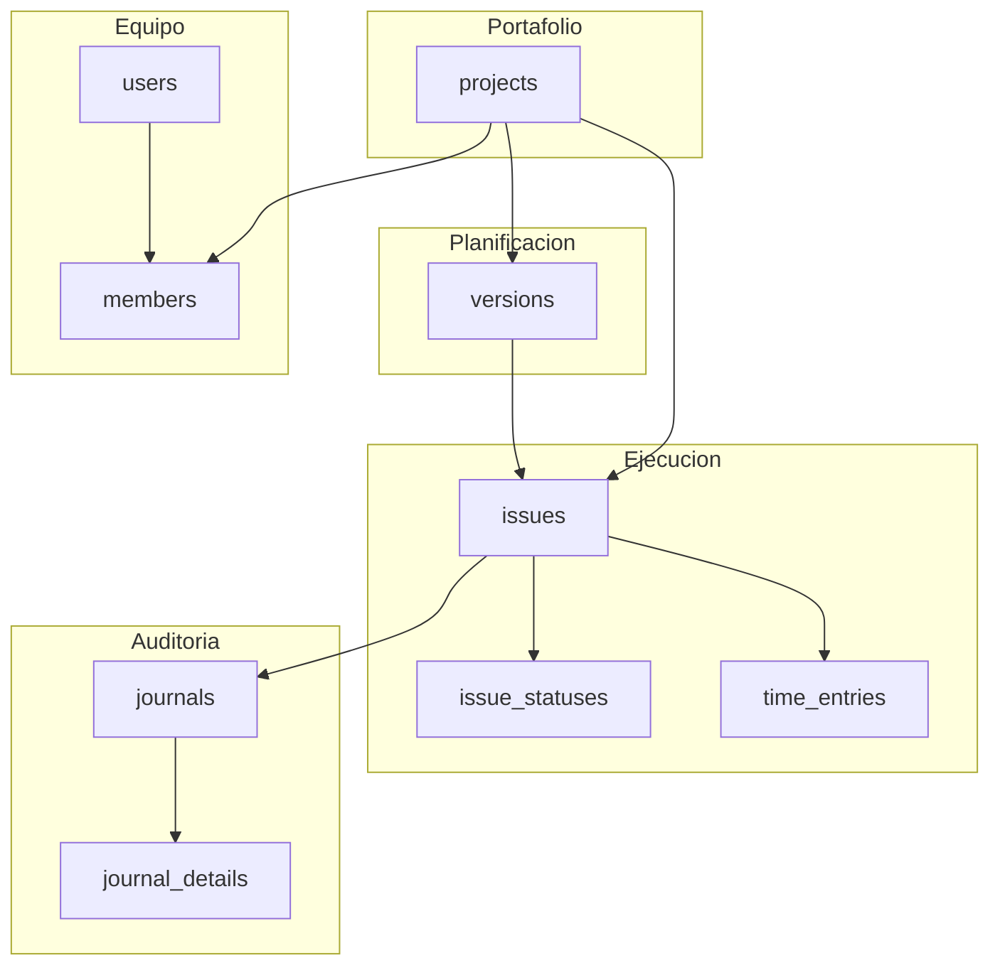
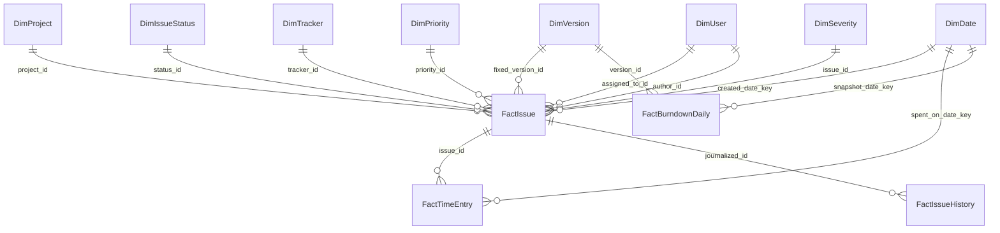

# Modelo de datos BI para Redmine

Especificación funcional para implementar un dashboard en Power BI sobre la base de datos MySQL de Redmine. Define procesos de negocio, dimensiones, tablas de hechos, reglas transversales y la lógica de cada KPI.

**Conexión a la base de datos:** ver [mysql-powerbi-connection.md](mysql-powerbi-connection.md).

---

## 1. Introducción y alcance

### 1.1 Qué es Redmine en este contexto

Redmine es un sistema de gestión de proyectos open source (Ruby on Rails) con base de datos relacional (MySQL o PostgreSQL). En este entorno simula el **portafolio de proyectos de una empresa**: proyectos, equipos, releases, tareas, tiempos registrados e historial de cambios.

### 1.2 Alcance del documento

| Incluido | Excluido |
|----------|----------|
| Modelo dimensional (star schema) para Power BI | Implementación de vistas SQL (fase posterior) |
| Definición de 6 KPIs del dashboard | Diseño visual del informe |
| Reglas de negocio y consideraciones de calidad de datos | Usuario read-only dedicado (pendiente) |
| Escenarios nativos (versiones) y extensiones (Agile, severidad custom) | Plugin Agile no instalado por defecto |

### 1.3 Convenciones

- **Base de datos:** `redmine_db` (MySQL 5.7).
- **Zona horaria:** timestamps almacenados en UTC del servidor; convertir en Power BI si se requiere hora local.
- **Granularidad principal:** una fila por issue (`issues`) y una fila por registro de tiempo (`time_entries`).
- **Issue = tarea** en terminología ágil.

---

## 2. Procesos de negocio principales

Redmine modela el ciclo operativo del portafolio. Cada proceso alimenta tablas concretas del modelo analítico.

**Diagrama Draw.io:** [redmine-business-processes.drawio](diagrams/redmine-business-processes.drawio)



### 2.1 Mapa proceso → tablas → evento medible

| Proceso | Tablas | Evento medible |
|---------|--------|----------------|
| Gestión de portafolio | `projects` | Alta, jerarquía y estado de proyectos |
| Planificación de releases/sprints | `versions` | Milestone con fecha objetivo (`effective_date`) y estado |
| Ciclo de vida de tareas | `issues`, `issue_statuses`, `journals` | Creación, asignación, progreso (`done_ratio`), cierre (`closed_on`) |
| Registro de esfuerzo | `time_entries` | Horas reales registradas por día (`spent_on`) |
| Membresía de equipo | `members`, `member_roles`, `users`, `roles` | Quién participa en qué proyecto y con qué rol |
| Auditoría e historial | `journals`, `journal_details` | Cambios de estado, versión, porcentaje de avance |

### 2.2 Reglas operativas de Redmine relevantes para BI

1. **Cardinalidad en issues:** cada issue tiene un único estado (`status_id`), una versión objetivo opcional (`fixed_version_id`), un responsable opcional (`assigned_to_id`) y un autor (`author_id`).

2. **Cierre de tareas:** cuando el estado tiene `issue_statuses.is_closed = 1`, Redmine establece `issues.closed_on`. Un issue abierto tiene `is_closed = 0` y `closed_on` nulo.

3. **Subtareas:** la jerarquía se modela con `parent_id` y `root_id`. Contar issues sin filtrar nivel puede **duplicar métricas** (padre e hijos). Ver sección 5.

4. **Horas sin tarea:** `time_entries.issue_id` puede ser NULL; representa tiempo imputado al proyecto pero no a una tarea concreta.

5. **Progreso:** `done_ratio` (0–100) indica avance declarado; puede diferir del cierre binario (`is_closed`).

6. **Prioridad vs severidad:** Redmine incluye **prioridad** nativa (`priority_id` → `enumerations`). La **severidad** no es un campo estándar; se implementa como campo personalizado si la organización lo requiere.

---

## 3. Modelo dimensional (star schema)

### 3.1 Diagrama general

**Diagramas Draw.io:**

- [redmine-star-schema.drawio](diagrams/redmine-star-schema.drawio) — modelo dimensional (star schema)
- [redmine-source-er.drawio](diagrams/redmine-source-er.drawio) — esquema relacional fuente MySQL



### 3.2 Dimensiones

| Dimensión | Fuente SQL | Atributos clave | Reglas de carga |
|-----------|------------|-----------------|-----------------|
| **DimDate** | Generada en Power BI (`CALENDAR`) | Date, Year, Quarter, Month, Week, ISOWeek, DayOfWeek | Tabla desconectada o conectada según KPI; cubrir rango de `issues.created_on` a hoy |
| **DimProject** | `projects` | ProjectKey (= `id`), Name, Identifier, ParentProjectKey, Status, CreatedOn | Excluir archivados: `status = 1` (activo). Jerarquía vía `parent_id` |
| **DimUser** | `users` | UserKey (= `id`), Login, FirstName, LastName, IsActive | No importar `hashed_password`, `salt`. `IsActive = (status = 1)` |
| **DimIssueStatus** | `issue_statuses` | StatusKey (= `id`), Name, IsClosed, Position, DefaultDoneRatio | `IsClosed` define terminado en métricas de throughput y velocity |
| **DimVersion** | `versions` | VersionKey (= `id`), Name, ProjectKey, EffectiveDate, Status, Sharing | **Sprint nativo:** milestone asignado vía `issues.fixed_version_id` |
| **DimTracker** | `trackers` | TrackerKey (= `id`), Name, IsInRoadmap | Bug, Feature, Support, etc. |
| **DimPriority** | `enumerations` | PriorityKey (= `id`), Name, Position, IsDefault | Filtrar `type = 'IssuePriority'`. Proxy de severidad por defecto |
| **DimSeverity** | `custom_fields` + `custom_values` | SeverityKey, IssueKey, SeverityName, SeverityValue | Solo si existe campo custom "Severidad" (patrón EAV) |
| **DimMember** | `members` + `member_roles` + `roles` | MemberKey, UserKey, ProjectKey, RoleKey, RoleName | Tabla puente para análisis por rol/equipo |
| **DimSprint** (opcional) | Plugin `redmine_agile` | SprintKey, Name, StartDate, EndDate, ProjectKey | Solo si el plugin está instalado; ver sección 8 |

### 3.3 Tablas de hechos

| Tabla de hechos | Granularidad | Medidas | Claves foráneas |
|-----------------|--------------|---------|-----------------|
| **FactIssue** | 1 fila por issue | EstimatedHours, DoneRatio, IsClosed, ScheduleVarianceDays, ActualHours (calculada), HoursVariance | ProjectKey, StatusKey, VersionKey, TrackerKey, PriorityKey, SeverityKey, AuthorKey, AssigneeKey, CreatedDateKey, DueDateKey, ClosedDateKey |
| **FactTimeEntry** | 1 fila por `time_entries.id` | Hours | ProjectKey, IssueKey, UserKey, SpentOnDateKey, ActivityKey |
| **FactIssueHistory** | 1 fila por cambio relevante en journal | OldStatusKey, NewStatusKey, OldDoneRatio, NewDoneRatio | IssueKey, UserKey, ChangeDateKey |
| **FactBurndownDaily** | 1 fila por versión/sprint × día | RemainingHours, RemainingIssues, CompletedHours | VersionKey o SprintKey, SnapshotDateKey |

### 3.4 Relaciones en Power BI

| Desde | Hacia | Cardinalidad | Dirección del filtro |
|-------|-------|--------------|----------------------|
| DimProject | FactIssue | 1 → * | Single |
| DimVersion | FactIssue | 1 → * | Single |
| DimIssueStatus | FactIssue | 1 → * | Single |
| FactIssue | FactTimeEntry | 1 → * | Single |
| FactIssue | FactIssueHistory | 1 → * | Single |
| DimDate | FactIssue (CreatedDateKey) | 1 → * | Single |
| DimDate | FactTimeEntry | 1 → * | Single |

Usar **IssueKey** como clave sustituta en Power BI si se renombran columnas `id`.

---

## 4. Diccionario de campos (tablas clave)

### 4.1 `issues`

| Campo | Tipo | Uso en BI |
|-------|------|-----------|
| `id` | int | Clave de FactIssue |
| `project_id` | int | FK → DimProject |
| `tracker_id` | int | FK → DimTracker |
| `status_id` | int | FK → DimIssueStatus |
| `priority_id` | int | FK → DimPriority |
| `fixed_version_id` | int | FK → DimVersion (sprint/release nativo) |
| `assigned_to_id` | int | FK → DimUser (responsable) |
| `author_id` | int | FK → DimUser (creador) |
| `subject` | varchar | Atributo descriptivo |
| `estimated_hours` | float | Estimación; base de burndown y variance de horas |
| `done_ratio` | int | Progreso 0–100 |
| `start_date`, `due_date` | date | Planificación; Schedule Variance |
| `created_on`, `updated_on` | timestamp | Auditoría |
| `closed_on` | datetime | Fecha de cierre; throughput y velocity |
| `parent_id`, `root_id` | int | Jerarquía de subtareas |
| `is_private` | tinyint | Filtrar según política de acceso |

### 4.2 `issue_statuses`

| Campo | Tipo | Uso en BI |
|-------|------|-----------|
| `id` | int | Clave |
| `name` | varchar | Etiqueta (New, In Progress, Resolved, Closed, …) |
| `is_closed` | tinyint | **Regla de negocio:** issue terminado |
| `position` | int | Orden en tablero |
| `default_done_ratio` | int | Avance por defecto al entrar al estado |

### 4.3 `time_entries`

| Campo | Tipo | Uso en BI |
|-------|------|-----------|
| `id` | int | Clave de FactTimeEntry |
| `project_id` | int | FK → DimProject |
| `issue_id` | int | FK → FactIssue (nullable) |
| `user_id` | int | FK → DimUser |
| `hours` | float | Horas reales |
| `spent_on` | date | Fecha del esfuerzo |
| `tyear`, `tmonth`, `tweek` | int | Desnormalizados por Redmine; preferir `spent_on` |
| `activity_id` | int | Tipo de actividad (Development, Design, …) |
| `comments` | varchar | Notas del registro |

### 4.4 `projects`

| Campo | Tipo | Uso en BI |
|-------|------|-----------|
| `id` | int | Clave |
| `name`, `identifier` | varchar | Nombre e identificador URL |
| `parent_id` | int | Jerarquía de portafolio |
| `status` | int | 1 = activo, 5 = archivado, 9 = cerrado |
| `default_version_id` | int | Versión por defecto al crear issues |
| `lft`, `rgt` | int | Nested set para árbol de proyectos |

### 4.5 `members`

| Campo | Tipo | Uso en BI |
|-------|------|-----------|
| `id` | int | Clave de membresía |
| `user_id` | int | FK → DimUser |
| `project_id` | int | FK → DimProject |
| `created_on` | timestamp | Alta en el proyecto |

Relacionar con `member_roles` y `roles` para obtener nombres de rol (Developer, Manager, …).

### 4.6 `versions`

| Campo | Tipo | Uso en BI |
|-------|------|-----------|
| `id` | int | Clave; representa sprint/milestone nativo |
| `project_id` | int | FK → DimProject |
| `name` | varchar | Nombre del release/sprint |
| `effective_date` | date | Fecha objetivo del milestone |
| `status` | varchar | `open` o `closed` |
| `sharing` | varchar | `none`, `descendants`, `hierarchy`, `tree`, `system` |

### 4.7 `journals` y `journal_details`

**`journals`**

| Campo | Tipo | Uso en BI |
|-------|------|-----------|
| `id` | int | Clave |
| `journalized_id` | int | FK → issue (`journalized_type = 'Issue'`) |
| `journalized_type` | varchar | Filtrar `'Issue'` |
| `user_id` | int | Quién realizó el cambio |
| `created_on` | datetime | Cuándo ocurrió |

**`journal_details`**

| Campo | Tipo | Uso en BI |
|-------|------|-----------|
| `journal_id` | int | FK → journals |
| `property` | varchar | `'attr'` para cambios de campo |
| `prop_key` | varchar | `'status_id'`, `'done_ratio'`, `'fixed_version_id'`, … |
| `old_value`, `value` | longtext | Valores anterior y nuevo |

Estas tablas permiten reconstruir **burndown histórico** y validar fechas de cierre.

### 4.8 `users`

| Campo | Tipo | Uso en BI |
|-------|------|-----------|
| `id` | int | Clave |
| `login`, `firstname`, `lastname` | varchar | Identificación |
| `status` | int | 1 = activo, 3 = locked |
| `admin` | tinyint | Flag administrador |

No incluir campos de autenticación en el modelo semántico.

---

## 5. Reglas de negocio transversales

### 5.1 Definiciones canónicas

| Concepto | Regla |
|----------|-------|
| Issue cerrado | `issue_statuses.is_closed = 1` (join por `issues.status_id`) |
| Issue abierto | `issue_statuses.is_closed = 0` |
| Issue raíz | `parent_id IS NULL` |
| Subtarea | `parent_id IS NOT NULL` |
| Horas reales de un issue | `SUM(time_entries.hours) WHERE issue_id = issues.id` |
| Horas no asignadas | `time_entries` con `issue_id IS NULL` |

### 5.2 Subtareas y doble conteo

| Métrica | Regla recomendada |
|---------|-------------------|
| Throughput, conteo de issues | Solo issues raíz (`parent_id IS NULL`) |
| Burndown (conteo) | Solo issues raíz o solo hojas; documentar convención elegida |
| Estimado vs real, velocity en horas | Incluir subtareas si el esfuerzo se registra en ellas |
| Story points | Evitar sumar padre e hijos si ambos tienen puntos |

### 5.3 Versiones compartidas

`versions.sharing` permite que una versión sea visible en varios proyectos. Para atribución analítica, **usar siempre `issues.project_id`**, no solo `versions.project_id`.

### 5.4 Usuarios y privacidad

- Excluir usuarios inactivos (`status != 1`) de slicers activos; mantenerlos en hechos históricos.
- Issues privados (`is_private = 1`): la cuenta de BI debe tener permisos acordes o aplicar filtros de seguridad a nivel fila (RLS) en Power BI.

### 5.5 Valores nulos

| Campo | Impacto | Tratamiento |
|-------|---------|-------------|
| `estimated_hours` NULL | Burndown y variance de horas incompletos | Excluir o imputar 0 según política; documentar en el informe |
| `due_date` NULL | Schedule Variance no calculable | Excluir del KPI SV |
| `fixed_version_id` NULL | Issue sin sprint asignado | Bucket "Sin versión" en dimensiones |

---

## 6. KPIs del dashboard

Para cada KPI: definición, fuentes, filtros, fórmulas SQL/DAX sugeridas y excepciones.

### 6.1 Schedule Variance (SV)

**Definición:** desviación entre la fecha planificada de fin y la fecha real de cierre. Valores positivos indican retraso; negativos, adelanto.

**Nivel issue**

```
SV_days = DATEDIFF(closed_on, due_date)
```

| Aspecto | Detalle |
|---------|---------|
| Fuentes | `issues.due_date`, `issues.closed_on`, `issue_statuses.is_closed` |
| Filtros | Solo issues cerrados con `due_date IS NOT NULL` |
| Medida DAX (ejemplo) | `Schedule Variance Days = DATEDIFF(FactIssue[DueDate], FactIssue[ClosedDate], DAY)` |

**Nivel versión/sprint (nativo)**

```
SV_version_days = DATEDIFF(MAX(closed_on), versions.effective_date)
```

Agregar por `fixed_version_id` comparando la última fecha de cierre de issues de esa versión contra `versions.effective_date`.

**Anexo — variante Earned Value (opcional)**

- Valor planificado (PV): `estimated_hours` total de la versión.
- Valor ganado (EV): `estimated_hours × done_ratio / 100`.
- Schedule Variance clásico: `SV = EV - PV` en horas (requiere snapshot temporal; más complejo).

---

### 6.2 Burndown por sprint/versión

**Definición:** evolución del trabajo restante en un periodo (sprint o versión). Eje X = tiempo; Eje Y = trabajo pendiente.

**Medidas posibles del eje Y**

| Medida | Fórmula (snapshot) |
|--------|-------------------|
| Horas restantes | `SUM(estimated_hours × (1 - done_ratio/100))` para issues abiertos |
| Issues abiertos | `COUNT` de issues con `is_closed = 0` |
| Story points | Campo custom pivotado; misma lógica que horas |

**Escenario A — snapshot actual (fase 1, simple)**

Solo estado vigente; no requiere historial:

```sql
SELECT
  v.id AS version_id,
  v.name,
  SUM(i.estimated_hours * (1 - i.done_ratio / 100)) AS remaining_hours,
  SUM(CASE WHEN s.is_closed = 0 THEN 1 ELSE 0 END) AS open_issues
FROM versions v
JOIN issues i ON i.fixed_version_id = v.id
JOIN issue_statuses s ON s.id = i.status_id
WHERE i.parent_id IS NULL
GROUP BY v.id, v.name;
```

**Escenario B — burndown histórico (fase 2)**

Reconstruir estado por día usando `journal_details`:

```sql
-- Cambios relevantes: status_id, done_ratio, fixed_version_id
SELECT jd.prop_key, jd.old_value, jd.value, j.created_on, j.journalized_id
FROM journals j
JOIN journal_details jd ON jd.journal_id = j.id
WHERE j.journalized_type = 'Issue'
  AND jd.property = 'attr'
  AND jd.prop_key IN ('status_id', 'done_ratio', 'fixed_version_id');
```

Generar **FactBurndownDaily** en Power Query o vista SQL: para cada versión y cada día del calendario, calcular horas/issues restantes según el último estado conocido.

**Limitación:** Redmine no materializa snapshots diarios; la reconstrucción es costosa en Import mode para volúmenes grandes.

---

### 6.3 Throughput (tareas por semana)

**Definición:** cantidad de issues que **se cerraron** en una semana calendario o ISO.

| Aspecto | Detalle |
|---------|---------|
| Fuente primaria | `issues.closed_on` |
| Fuente alternativa | `FactIssueHistory` cuando `new_status.is_closed = 1` |
| Filtros | Issues raíz; `closed_on IS NOT NULL` |
| Agrupación | `ISOWeek(closed_on)`, `project_id`, opcionalmente `tracker_id` |

**SQL**

```sql
SELECT
  YEARWEEK(i.closed_on, 3) AS iso_year_week,
  i.project_id,
  COUNT(*) AS throughput
FROM issues i
JOIN issue_statuses s ON s.id = i.status_id
WHERE s.is_closed = 1
  AND i.closed_on IS NOT NULL
  AND i.parent_id IS NULL
GROUP BY iso_year_week, i.project_id;
```

**DAX (ejemplo)**

```
Throughput = COUNTROWS(FILTER(FactIssue, FactIssue[IsClosed] = TRUE))
```

Usar `ClosedDateKey` relacionada con `DimDate[ISOWeek]` para el eje temporal.

---

### 6.4 Estimado vs real (horas)

**Definición:** comparación entre esfuerzo planificado (`estimated_hours`) y esfuerzo registrado (`time_entries.hours`).

**Por issue**

```
Estimated = issues.estimated_hours
Actual    = SUM(time_entries.hours)
Variance  = Actual - Estimated
Variance% = DIVIDE(Actual - Estimated, Estimated)
```

**SQL**

```sql
SELECT
  i.id,
  i.estimated_hours,
  COALESCE(SUM(t.hours), 0) AS actual_hours,
  COALESCE(SUM(t.hours), 0) - COALESCE(i.estimated_hours, 0) AS variance
FROM issues i
LEFT JOIN time_entries t ON t.issue_id = i.id
GROUP BY i.id, i.estimated_hours;
```

**Reglas**

- Excluir `time_entries` sin `issue_id` del cálculo por issue.
- Reportar por separado **horas no asignadas a tarea** (`issue_id IS NULL`) a nivel proyecto.
- Issues sin estimación: excluir del `% variance` o mostrar en categoría "Sin estimación".

---

### 6.5 Velocidad del equipo

**Definición:** trabajo **completado** por el equipo en un sprint/versión. No es compromiso futuro; es capacidad demostrada.

**Convención por horas (nativo)**

```
Velocity = SUM(estimated_hours)
  de issues cerrados
  WHERE fixed_version_id = @version_id
  AND parent_id IS NULL
```

**Variante con story points**

Si existe campo custom "Story points", usar ese valor en lugar de `estimated_hours`.

**Velocity per cápita (opcional)**

```
VelocityPerMember = Velocity / COUNT(DISTINCT members.user_id)
```

Solo miembros activos del proyecto durante el periodo del sprint.

**Filtros**

- Issue cerrado (`is_closed = 1`).
- Atribuido a la versión vía `fixed_version_id`.
- Opcional: acotar por `closed_on` dentro del rango del sprint.

---

### 6.6 Distribución de issues por severidad

Redmine no define severidad de forma nativa. Se documentan **dos escenarios**; si coexisten, usar severidad custom como dimensión principal.

#### Escenario A — Prioridad como proxy (`priority_id`)

```sql
SELECT e.name AS priority, COUNT(*) AS issue_count
FROM issues i
JOIN enumerations e ON e.id = i.priority_id AND e.type = 'IssuePriority'
WHERE i.parent_id IS NULL
GROUP BY e.name, e.position
ORDER BY e.position;
```

Valores típicos: Low, Normal, High, Urgent, Immediate.

#### Escenario B — Campo personalizado "Severidad"

Patrón EAV (`custom_fields` + `custom_values`):

```sql
SELECT
  i.id AS issue_id,
  cf.name AS field_name,
  cv.value AS severity
FROM issues i
JOIN custom_values cv
  ON cv.customized_type = 'Issue' AND cv.customized_id = i.id
JOIN custom_fields cf ON cf.id = cv.custom_field_id
WHERE cf.name = 'Severidad';
```

Pivotar en Power Query o crear columna calculada en `FactIssue`.

#### Visualización recomendada

- Gráfico de barras o dona: `% issues` por severidad/prioridad.
- Slicer dual: Severidad (custom) y Prioridad (nativa) para análisis cruzado.

---

## 7. Escenarios duales: sprint y severidad

### 7.1 Sprint: versiones nativas vs plugin Agile

| Aspecto | Versiones nativas (`versions`) | Plugin Redmine Agile |
|---------|-------------------------------|----------------------|
| Disponibilidad | Siempre presente | Requiere instalar `redmine_agile` |
| Asignación | `issues.fixed_version_id` | Tablas `agile_sprints`, `agile_data` (nombres típicos) |
| Fechas de sprint | `versions.effective_date` (una fecha objetivo) | `start_date`, `end_date` explícitos |
| Burndown | Reconstrucción vía journals o snapshot | Tablero Agile puede aportar datos más ricos |
| Recomendación | **Default** para este entorno Docker | Documentar como extensión cuando se instale el plugin |

**Tablas Agile esperadas (referencia)**

| Tabla | Propósito |
|-------|-----------|
| `agile_sprints` | Definición de sprints con fechas inicio/fin |
| `agile_data` | Posición de issues en tablero, sprint asignado |
| `agile_estimates` | Estimaciones ágiles adicionales |

Verificar con `SHOW TABLES LIKE 'agile%'` antes de modelar DimSprint.

### 7.2 Severidad: prioridad vs campo custom

| Aspecto | DimPriority | DimSeverity |
|---------|-------------|-------------|
| Fuente | `enumerations` (IssuePriority) | `custom_values` + `custom_fields` |
| Configuración | Out of the box | Crear campo en Administración → Campos personalizados |
| Valores | Prioridad operativa | Escala de severidad de negocio (Critical, Major, Minor, …) |
| KPI afectado | Distribución por severidad (proxy) | Distribución por severidad (precisa) |

**Recomendación:** mantener ambas dimensiones en el modelo. El dashboard principal usa DimSeverity si existe; si no, fallback a DimPriority con nota al pie "Prioridad operativa (proxy de severidad)".

---

## 8. Consideraciones para Power BI

### 8.1 Modo de conectividad

| Modo | Cuándo usar |
|------|-------------|
| **Import** | Recomendado: joins múltiples, burndown derivado, mejor rendimiento en visualizaciones |
| **DirectQuery** | Datos muy grandes o necesidad de frescura en tiempo real; limita transformaciones |

### 8.2 Tabla calendario

Crear `DimDate` con DAX:

```dax
DimDate = ADDCOLUMNS(
  CALENDAR(DATE(2020, 1, 1), TODAY()),
  "Year", YEAR([Date]),
  "Month", FORMAT([Date], "YYYY-MM"),
  "ISOWeek", WEEKNUM([Date], 21)
)
```

Relacionar por claves de fecha (`CreatedDateKey`, `ClosedDateKey`, `SpentOnDateKey`) según el visual.

### 8.3 Transformaciones sugeridas en Power Query

1. Unir `issues` + `issue_statuses` para columna `IsClosed`.
2. Agregar columna `ActualHours` agrupando `time_entries`.
3. Pivotar severidad custom desde `custom_values`.
4. Filtrar `journals` con `journalized_type = 'Issue'`.

### 8.4 Vistas SQL (fase posterior, opcional)

Simplificar el modelo con vistas como `vw_fact_issues` y `vw_fact_time_entries`. No forman parte de este entregable.

### 8.5 Seguridad

- Crear usuario MySQL read-only para Power BI.
- Evaluar Row-Level Security en Power BI si múltiples equipos consumen el mismo informe.
- No publicar a Power BI Service sin On-premises data gateway mientras la fuente sea `127.0.0.1`.

---

## 9. Anexos

### 9.1 Checklist de validación (cuando existan datos)

- [ ] Conteo de issues cerrados = conteo con `is_closed = 1`.
- [ ] `closed_on` poblado para todo issue en estado cerrado.
- [ ] Suma de `time_entries.hours` por issue coincide con `ActualHours` en FactIssue.
- [ ] Issues con `fixed_version_id` pertenecen al proyecto esperado.
- [ ] Campo custom "Severidad" existe si se usa DimSeverity (`SELECT * FROM custom_fields WHERE name = 'Severidad'`).
- [ ] Tablas `agile_*` presentes si se modela DimSprint.

### 9.2 Resumen de KPIs

| KPI | Grano principal | Campos clave | Dimensión temporal |
|-----|-----------------|--------------|-------------------|
| Schedule Variance | Issue / Versión | `due_date`, `closed_on`, `effective_date` | Fecha de cierre |
| Burndown | Versión × día | `estimated_hours`, `done_ratio`, journals | Calendario |
| Throughput | Semana | `closed_on`, `is_closed` | ISO Week |
| Estimado vs real | Issue / Proyecto | `estimated_hours`, `time_entries.hours` | `spent_on` |
| Velocidad | Versión/sprint | `estimated_hours`, `fixed_version_id`, cierre | Rango del sprint |
| Distribución severidad | Issue | `priority_id` o custom Severidad | N/A (snapshot) |

### 9.3 Tablas fuente requeridas en Power BI

**Mínimo:** `issues`, `issue_statuses`, `time_entries`, `projects`, `members`, `versions`, `journals`, `users`.

**Soporte recomendado:** `trackers`, `enumerations`, `journal_details`, `custom_fields`, `custom_values`, `member_roles`, `roles`.

**Opcional (Agile):** `agile_sprints`, `agile_data`, y tablas relacionadas del plugin.
